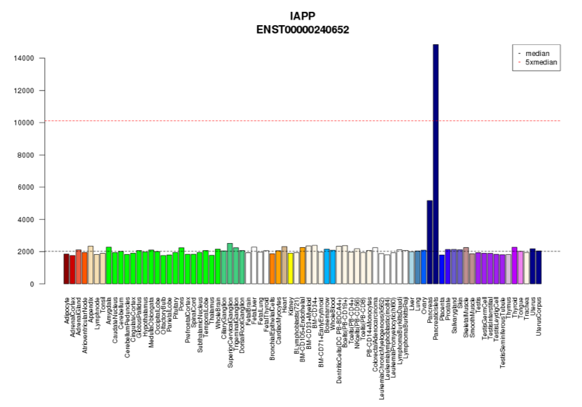
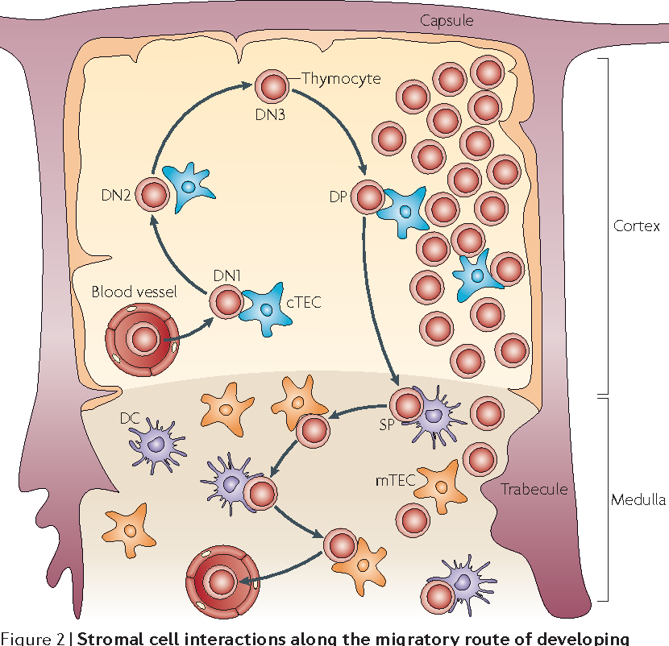
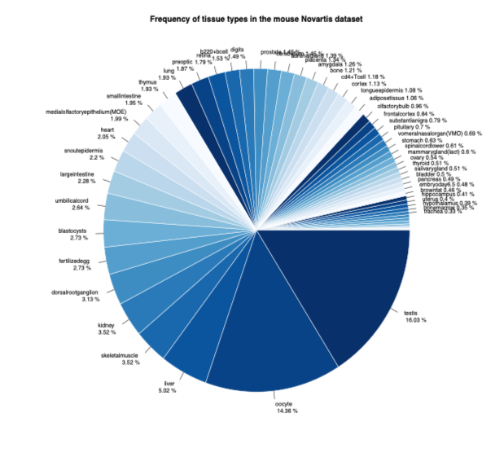
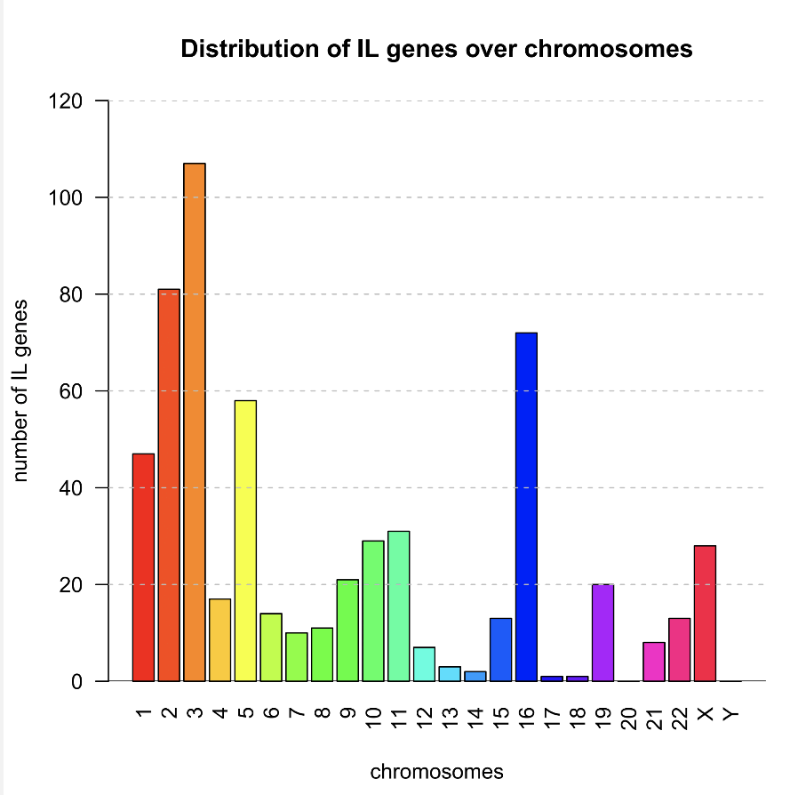
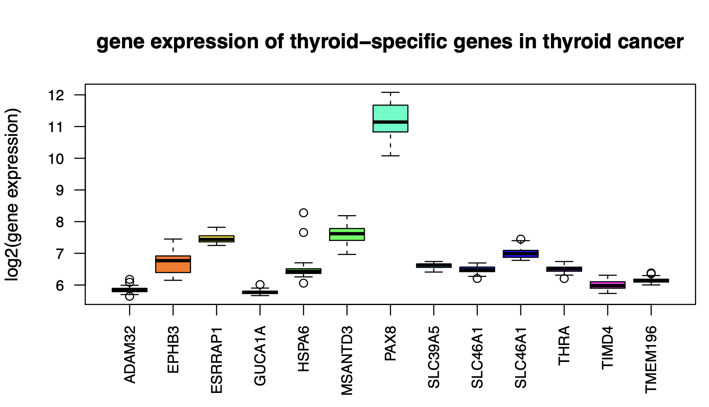
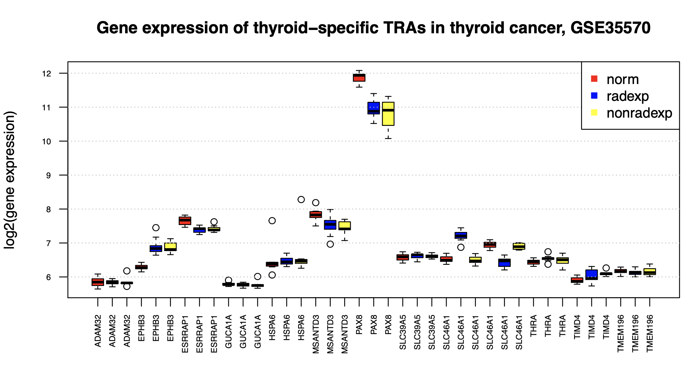

# Topic 2: The role of tissue-specific antigens in different cancer entities

**Supervisor:**

* Dr. Maria Dinkelacker (m.dinkelacker@dkfz.de)

**Introduction:**

Tissue restricted antigens (TRAs) are genes, which are highly expressed in a few tissues, but not in others. These genes are up-regulated in the medullary part of the thymus (mTECs) in order to teach developing T-cells in a process called negative selection not to react to them. These T cells are out selected by apoptosis. Only 5% of all T cells survive these selection procedures (positive selection and negative selection). While they are tested in the positive selection on self-MHC they are tested in the negative selection on self-antigens-self MHC.
If these selection procedures don’t work well, human suffer of multiple autoimmune diseases. [Kyewski et al. 2004]. For some reason these genes are often up-regulated in cancer, although this atopic gene expression should not take place and can due to the negative selection of T cells in the thymus not react to these genes. The tumor down regulates the MHC molecules and escapes the immune system. 

For this reason tissue-restricted antigens (TRAs) are potentially good drug targets both in cancer therapy as also in cancer immunotherapy. Among these genes, there are several gene groups, which have been already in focus of cancer immunotherapy, such as testis-specific antigens (CTAs), but also oocyte-specific genes, others are still very unknown, such as kallikrein genes, casein genes, skin-specific genes, pancreas-specific genes, and the role of TRAs in developmental processes in general.


<div class="figure" style="text-align: center">

<p class="caption">Fig. 1 </p>
</div>


**Literature:** 

* Kyewski et al. 2004, Self-representation in the thymus: an extended view, Nat. Rev. Immunol. 2004 Sep, 4 (9) 699-698. https://pubmed.ncbi.nlm.nih.gov/15343368/

* Rosenberg et al. 1999. A new era for cancer immunotherapy based on the genes that encode cancer antigens. Immunity. 1999 Mar;10(3):281-7. https://pubmed.ncbi.nlm.nih.gov/10204484/

**Further reading**

* Anderson et al. 2016, AIRE expands: new roles in immune tolerance and beyond.
Nat Rev Immunol. 2016 Apr;16(4):247-58.
https://pubmed.ncbi.nlm.nih.gov/26972725/

* Gotter et al. 2004, Medullary epithelial cells of the human thymus express a highly diverse selection of tissue-specific genes colocalized in chromosomal clusters.J Exp Med. 2004 Jan 19;199(2):155-66.
https://pubmed.ncbi.nlm.nih.gov/14734521/

* Klein et al. 2009, Antigen presentation in the thymus for positive selection and central tolerance induction. Nat Rev Immunol. 2009 Dec;9(12):833-44.
https://pubmed.ncbi.nlm.nih.gov/19935803/

* Kyewski et al. 2006, A central role for central tolerance.
Kyewski B, Klein L. Annu Rev Immunol. 2006;24:571-606. https://pubmed.ncbi.nlm.nih.gov/16551260/

* Kyewski et al. 2008, Immunology. A breath of Aire for the periphery.
Science. 2008 Aug 8;321(5890):776-7. https://pubmed.ncbi.nlm.nih.gov/18687943/

* Klein et al. 2009, Antigen presentation in the thymus for positive selection and central tolerance induction. Nat Rev Immunol. 2009 Dec;9(12):833-44. https://pubmed.ncbi.nlm.nih.gov/19935803/

* Klein et al. 2014, Positive and negative selection of the T cell repertoire: what thymocytes see (and don't see). Nat Rev Immunol. 2014 Jun;14(6):377-91. 
https://pubmed.ncbi.nlm.nih.gov/24830344/

**Source to cite in the end for the TRA data**

* Dinkelacker 2019. Chromosomal clustering of tissue restricted antigens, Dissertation, University Heidelberg, Germany.

* Dinkelacker 2007. A database of genes that are expressed in a tissue-restricted manner to analyse promiscous gene expression in medullary thymic epithelial cells. Diplomarbeit, Albert-Ludwigs-Universitaet, Freiburg, Germany.


<div class="figure" style="text-align: center">

<p class="caption">T cell development in the thymus, Klein et al. 2009</p>
</div>

**Objectives:**

Please get ***TRA data*** from Dr. Dinkelacker, 2007, 2019 (6 different datasets).
These datasets were obtained from the following publications: Su et al. 2002, 2004 (mouse Novartis data), Roth et al. 2008 (human Roth data), Lattin et al. 2006 (mouse Lattin data), human GTEX data 2015 (RNAseq data), and protein atlas data (protein data). (see below for exact references)

**Literature:**

**To cite the origin of the TRA data (not needed for reading)**

*  Su et al. 2002, Large-scale analysis of the human and mouse transcriptomes.
Proc Natl Acad Sci U S A. 2002 Apr 2;99(7):4465-70. https://pubmed.ncbi.nlm.nih.gov/11904358/

* Su et al. 2004, A gene atlas of the mouse and human protein-encoding transcriptomes. Proc Natl Acad Sci U S A. 2004 Apr 20;101(16):6062-7. https://pubmed.ncbi.nlm.nih.gov/15075390/

*  Roth et al. 2006, Gene expression analyses reveal molecular relationships among 20 regions of the human CNS. Neurogenetics. 2006 May;7(2):67-80. https://pubmed.ncbi.nlm.nih.gov/16572319/

* Lattin et al. 2008, Expression analysis of G Protein-Coupled Receptors in mouse macrophages. Immunome Res. 2008 Apr 29;4:5. https://pubmed.ncbi.nlm.nih.gov/18442421/

* GTEX 2013, The Genotype-Tissue Expression (GTEx) project.
GTEx Consortium. Nat Genet. 2013 Jun;45(6):580-5. https://pubmed.ncbi.nlm.nih.gov/23715323/

* GTEX 2015, Human genomics. The Genotype-Tissue Expression (GTEx) pilot analysis: multitissue gene regulation in humans.
GTEx Consortium. Science. 2015 May 8;348(6235):648-60. https://pubmed.ncbi.nlm.nih.gov/25954001/

* Uhlén et al. 2015, Proteomics. Tissue-based map of the human proteome.
Science. 2015 Jan 23;347(6220):1260419. https://pubmed.ncbi.nlm.nih.gov/25613900/

Try to import these tables (.csv) files into R `a=read.csv(file="filename",sep="\t")` and get an overview of tissue-distribution, and the role of the gene group of your interest in the datasets (`ind=grep("^Klk",symbols);Kallikreins=symbols[ind]`). (Follow here the basic steps, denoted in the R course from Carl Hermann, lecture 1, 2, 3 and the R Course from Maria Dinkelacker, lecture 1, 2). Please use the union(TRAs1,TRAs2,...) of all six tables for this calculation.

For example the Klk genes from the mouse Novartis TRA list are:

------------------------
> Kallikreins
 [1] "Klk1b16"   "Klk1b11"   "Klk10"     "Klk7"      "Klk5"      "Klk1b26"  
 [7] "Klk1b8"    "Klk1b24"   "Klk1b5"    "Klk1b4"    "Klk1b1"    "Klk1b7-ps"
[13] "Klk1b27"   "Klk11"     "Klk1b9"    "Klk1b3"    "Klk1b21"   "Klk8"     
[19] "Klkb1"     "Klk11"     "Klk1b7-ps"
------------------------

For example thyroid-specific TRAs:

---
```r
a=read.csv(file="tra.2014.mouse.5x.table.tsv",sep="\t")

tiss=a[,11]

ind=which(tiss=="thyroid")

TRA.symbol=a[,3]

thyroid.TRA1=TRA.symbol[ind]
```
---

-	**Klk genes (Project 1) – any cancer**
-	**Csn genes (Project 2) – any cancer**
-	**Skin spec. genes (Project 3) – skin cancer**
-	**Pancreas spec. genes (Project 4) – pancreas CA**
-	**Thyroid spec. genes (Project 5) – thyroid cancer**

**Literature:**

**Literature to cite the idea, not needed to read**

* Dinkelacker 2019. Chromosomal clustering of tissue restricted antigens, Dissertation, University Heidelberg, Germany.

* Dinkelacker 2007. A database of genes that are expressed in a tissue-restricted manner to analyse promiscous gene expression in medullary thymic epithelial cells. Diplomarbeit, Albert-Ludwigs-Universitaet, Freiburg, Germany.

**Literature, to get to know your gene group of interest**

**Casein genes:**

* Derbinski et al. 2008, Promiscuous gene expression patterns in single medullary thymic epithelial cells argue for a stochastic mechanism, 
Proc Natl Acad Sci U S A. 2008 Jan 15;105(2):657-62.
https://pubmed.ncbi.nlm.nih.gov/18180458/

**Kallikrein genes:**

* Brennecke et al. 2015, Single-cell transcriptome analysis reveals coordinated ectopic gene-expression patterns in medullary thymic epithelial cells.
Nat Immunol. 2015 Sep;16(9):933-41. https://pubmed.ncbi.nlm.nih.gov/26237553/

* Derbinski et al. 2005, Linking signalling pathways, thymic stroma integrity and autoimmunity. Trends Immunol. 2005 Oct;26(10):503-6. https://pubmed.ncbi.nlm.nih.gov/16039157/

* Pinto et al. 2013, Overlapping gene coexpression patterns in human medullary thymic epithelial cells generate self-antigen diversity. Proc Natl Acad Sci U S A. 2013 Sep 10;110(37):E3497-505. https://pubmed.ncbi.nlm.nih.gov/23980163/

**Skin specific genes:**

* Mahy et al. 2002, Gene density and transcription influence the localization of chromatin outside of chromosome territories detectable by FISH.
J Cell Biol. 2002 Dec 9;159(5):753-63. https://pubmed.ncbi.nlm.nih.gov/12473685/

* Volz et al. 1993. Physical mapping of a functional cluster of epidermal differentiation genes on chromosome 1q21. Genomics. 1993 Oct;18(1):92-9. https://pubmed.ncbi.nlm.nih.gov/8276421/

* Zhao et al. 1997. Positional cloning of novel skin-specific genes from the human epidermal differentiation complex. Genomics. 1997 Oct 15;45(2):250-8. https://pubmed.ncbi.nlm.nih.gov/9344646/

*  Gordon et al. 2013. Skin cancer: an overview of epidemiology and risk factors. Semin Oncol Nurs. 2013 Aug;29(3):160-9. https://pubmed.ncbi.nlm.nih.gov/23958214/

*  Linares et al. 2015. Skin Cancer. Prim Care. 2015 Dec;42(4):645-59. https://pubmed.ncbi.nlm.nih.gov/26612377/

**Pancreas specific genes:**

*  MacDonald et al. 1981. Pancreas-specific genes: structure and expression.
Cancer. 1981 Mar 15;47(6 Suppl):1497-504. https://pubmed.ncbi.nlm.nih.gov/6168351/

* Kleeff et al. 2016. Pancreatic cancer. Nat Rev Dis Primers. 2016 Apr 21;2:16022. https://pubmed.ncbi.nlm.nih.gov/27158978/

**Thyroid specific genes:**

* Ajjan et al. 2015. The Pathogenesis of Hashimoto's Thyroiditis: Further Developments in our Understanding. Horm Metab Res. 2015 Sep;47(10):702-10. https://pubmed.ncbi.nlm.nih.gov/26361257/

* Dong et al. 2014. Autoimmune thyroid disease: mechanism, genetics and current knowledge. Rev Med Pharmacol Sci. 2014;18(23):3611-8. https://pubmed.ncbi.nlm.nih.gov/25535130/

* Albi et al. 2017. Radiation and Thyroid Cancer. Int J Mol Sci. 2017 Apr 26;18(5):911. https://pubmed.ncbi.nlm.nih.gov/28445397/


<div class="figure" style="text-align: center">

<p class="caption">Piechart of distribution of tissue-type (all TRAs), always use the max tissue type here.</p>
</div>


<div class="figure" style="text-align: center">

<p class="caption">Barplot of your genes of your group per chromosome, please be aware, that the X chromosome is a ***“character”***, while the others are numbers, and R does not like both datatypes in one object. Also note that the order is correct 1,2,3, not 1,10,11,2, …, use an order function or sorting vector for this) (Vgl. task 2, R Course **"Dinkelacker"**)</p>
</div>

## Data retrieval and data analysis

Please get the R course **"Dinkelacker"**, part 1 and 2 in order to learn how to analyze microarray data (task 6). If you want to complete out of this course now or later the complete R course and hand in the tasks you can get credits for this. Please sign up for this course independently.

We provide here step-by-step instructions on how to get from the raw microarray data (.CEL files) to a matrix with gene expression!

Download from dropbox folder https://www.dropbox.com/home/Bioinformatik%20TRA%20Projekt
all Microarrays of your group. There is one brest cancer dataset (the same for all, in order to learn how to analyze Microarrays) and then in each subfolder there are datasets for your own group.

First analyze the breast cancer dataset for your genes of interest and then proceed for the other datasets. Since your calculation power is limited, I only applied a few chips for each dataset. Also get the literature and more information on the data from the https://www.ncbi.nlm.nih.gov/geo/ by inserting the GSE number denoted in each subgroup folder.

Start by installing R https://www.r-project.org/ on your computer, if you don't have it yet, Bioconductor https://www.bioconductor.org/ and https://www.rstudio.com/. For the Microarrays you further need the following packages. affy, vsn and read in the ensembl.103.txt annotation file, which you can generate yourself. Please go for this to https://www.ensembl.org/index.html to Martview, select the latest human version, select the Ensembl gene ID, Transcript ID, gene Symbol, Chromosome, and the affy ID of the hgu133aplus2 chip (extras), go to Results, select unique results only and download the file as a .tsv file as ensembl.103.txt (Ensembl Version No.). Put it into a folder /tables/ in your project folder, read it in into R with a=read.csv(file="ensembl.103.txt", sep="\t"), see R code below.

### install packages affy() and vsn():


```r
if (!requireNamespace("BiocManager", quietly = TRUE))
    install.packages("BiocManager")

BiocManager::install("affy")
```


1. Put the rawdata .CEL files of each project into a folder called **"rawdata"**. 
Set the working directory with setwd() to the folder and read in the data with the ReadAffy() function (see R course **"Dinkelacker""**, task 6 for details.)

```r
library(affy)
library(vsn)

setwd(/rawdata/GSE...)
data=ReadAffy()
```


2. Do the quality control as denoted in the course, input, single chip control, normalization, RNAdeg plot, density plot, boxplot before and after normalization, meansd plot.

```r
data.norm=vsnrma(data)
```


3. Now try to extract from the dataset after normalization your genes of interest. In the course these are IL genes, here use your genes from the TRA data. For this extract the expression values from the normalized data with data.matrix=exprs(data.norm).

```r
data.matrix=exprs(data.norm)
head(data.matrix)
```


With `rownames(data)` you get the affy IDs and you can annotate them now with the `ensembl.103.txt` file with symbols and put them back in. rownames(data)=new.symbols.

```r
#read in ensembl annotation file (in dropbox folder)
a=read.csv("ensemble_103.txt",sep="\t")

head(a)
affy.ensembl=as.character(a[,5])

symbol.ensembl=as.character(a[,4])

names(symbol.ensembl)=affy.ensembl

head(symbol.ensembl)

#look into data matrix

head(data.matrix)

affyIDs=rownames(data.matrix)

symbol=symbol.ensembl[affyIDs]

head(symbol)

dim(data.matrix)

length(symbol)

#re-apply rownames to gene symbols in the data.matrix

rownames(data.matrix)=as.character(symbol)

head(data.matrix)

##This is the matrix you can calculate with##
```


Now select from the vector `new.symbols` the genes of your gene group of interest and get an integer vector pointing to the rows, you want to extract from your matrix only with your genes of interest. Please make sure, how many of your genes of interest you can find on the chip, and that you actually find them.

```r

row.ind=which(thyroid.TRA1%in%symbol)

#or (please, note that sometimes upper case and lower case and other problems disturb the search, for example levels, which you can eliminate with as.character and 
#toupper

row.ind=which(toupper(thyroid.TRA1) %in% as.character(symbol))

data.matrix.sub=data.matrix[row.ind,]
```


Now apply this index to your data matrix and extract the expression values for your genes only with `data.klk=data[ind,]`

Check with `head(data.klk)` if you got the correct genes, also with `dim(data.klk)` how many you got. Transform the matrix with `t(data.klk)` and make a boxplot from these. Sort the genes alphabetically and save the plots. (course **"Dinkelacker"**, task 6).


```r
par(las=2)

boxplot(t(data.sub),col=rainbow(length(rownames(data.sub))),main="gene expression of thyroid-specific genes in thyroid cancer",cex.axis=0.8)

#sort alphabetically

order.vector=sort(colnames(t(data.sub)),index.return=T)$ix

boxplot(t(data.sub)[,order.vector],col=rainbow(length(rownames(data.sub))),main="gene expression of thyroid-specific genes in thyroid cancer",cex.axis=0.8)
```


<div class="figure" style="text-align: center">

<p class="caption">Example 1 </p>
</div>

Or grouped by treatment in the example of thyroid genes for example (only a few genes)

```r
#three different treatments

data.new=rbind(data.sub,data.sub,data.sub)

data.new[c(1:13),c(ind.radexp,ind.radnonexp)]=NA

data.new[c(14:26),c(ind.norm,ind.radnonexp)]=NA

data.new[c(27:39),c(ind.norm,ind.radexp)]=NA

order.vector=sort(colnames(t(data.new)),index.return=T)$ix

boxplot(t(data.new)[,order.vector],cex.axis=0.6,col=c("red","blue","yellow"),main="Gene expression of thyroid-specific TRAs in thyroid cancer, GSE35570",ylab="log2(gene expression)")

abline(h=c(6:12),col="grey",lty=3)

legend("topright",c("norm","radexp","nonradexp"),col=c("red","blue","yellow"),pch=15,bg="white")

dev.copy2pdf(file="ex2.pdf")
```

<div class="figure" style="text-align: center">

<p class="caption">Example 2 </p>
</div>

With these genes do further analysis according to the course from Carl Hermann on the data matrix.

- heatmap*
- k-means*
- dendrogramm*
- hierarchical clustering*
- statistical test (limma analysis, t-test, F-test)*
- Venn diagram*

Compare groups here as you like, different treatments, healthy versus ill, etc. And in the end interprete your findings with the literature in pubmed. Look what has been known before, of what you found and what is new.

Save your R script and also your .rda file on your computer. Put all your plots as .pdf in the folder **"plots"** in the dropbox (one per subgroup) and also your .R script in the folder **"session"** and the data matrix only for your gene group as .csv in the folder **"tables"**.

Now do the exact same work flow for the other datasets only from your own group and document your work well.

If you need any help on any step, please contact me any time. If you like we apply a Whatsapp helping group for your projekt in this case send me you mobile number (this is a free option!) or contact me via e-mail at m.dinkelacker@dkfz.de.

**Remark:**

In the R script of the course material there are some mistakes, don’t use the Brainarray packages due to R version conflicts and don’t change the variable for these packages. Please contact me, if you have problems with this, if the vsnrma normalization doesn’t work, this is usually the mistake.

I tried to find some literature for you, please find more as you like, you have to understand the project, but not read all papers entirely, go as you like. Do research on a most wonderful topic.

Have fun! And go ahead and calculate ongoing scientific questions. Learn R and learn how to analyze Microarray data, you will be happy later, if you know how to do this. Everyone who took the R course **"Dinkelacker"** in principle should be able to help you. Mostly Master students so far.

We help, if you need any help. Our Motto: **"There are no stupid questions, only stupid answers"**

Dr. Maria Dinkelacker, m.dinkelacker@dkfz.de

